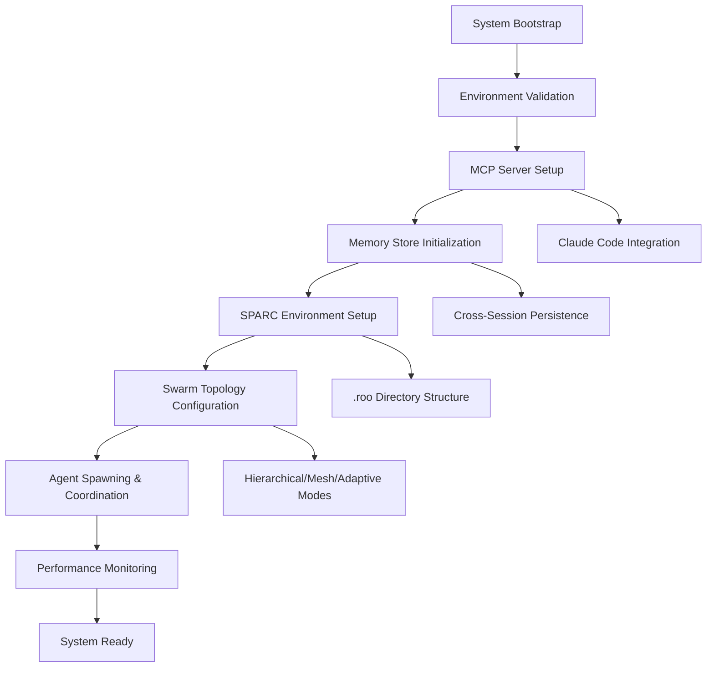

# Claude-Flow Alpha93+ Deployment Guide

## 🚀 Complete Initialization Command Flow Analysis

This comprehensive deployment guide provides the most effective initialization command flow structures and sequences for Claude-Flow Alpha93+ with advanced -roo functionality and swarm coordination capabilities.

## 📋 Table of Contents

1. [System Architecture Overview](#system-architecture-overview)
2. [Initialization Command Flow Structures](#initialization-command-flow-structures)
3. [MCP Server Configuration](#mcp-server-configuration)
4. [SPARC Methodology Integration](#sparc-methodology-integration)
5. [Swarm Topology Initialization](#swarm-topology-initialization)
6. [Memory Persistence & Session Management](#memory-persistence--session-management)
7. [Deployment Automation Scripts](#deployment-automation-scripts)
8. [Performance Optimization Patterns](#performance-optimization-patterns)
9. [Validation & Error Recovery](#validation--error-recovery)
10. [Best Practices & Troubleshooting](#best-practices--troubleshooting)

---

## System Architecture Overview

Claude-Flow Alpha93+ implements a sophisticated multi-layered initialization architecture:



### Core Components

- **MCP Server**: Model Context Protocol server for Claude Code integration
- **Memory Store**: SQLite-based persistent memory with fallback to in-memory
- **SPARC Engine**: Specification, Pseudocode, Architecture, Refinement, Completion methodology
- **Swarm Orchestrator**: Multi-agent coordination with various topologies
- **Performance Monitor**: Real-time metrics and optimization

---

## Initialization Command Flow Structures

### 1. Enhanced Claude Flow Initialization (Default)

The primary initialization sequence for Claude-Flow Alpha93+:

```bash
# Primary initialization command
npx claude-flow@alpha init --force

# With SPARC/roo functionality
npx claude-flow@alpha init --roo --force

# Dry run to preview changes
npx claude-flow@alpha init --dry-run --roo
```

#### Initialization Sequence Flow:

```javascript
// 1. Environment Validation
const initSequence = [
  'validateNodeVersion',      // Node.js >= 20.0.0
  'validateNpmVersion',       // npm >= 9.0.0
  'checkClaudeCodeCLI',      // Claude CLI availability
  'validateWorkingDirectory', // Project structure validation
];

// 2. File System Setup
const fileSystemSetup = [
  'createClaudeDirectory',    // .claude/ structure
  'createRooDirectory',       // .roo/ SPARC environment
  'generateClaudeMd',         // CLAUDE.md configuration
  'createSettingsJson',       // .claude/settings.json
  'createMcpConfig',          // .mcp.json for MCP servers
  'createClaudeFlowConfig',   // claude-flow.config.json
];

// 3. MCP Server Registration
const mcpSetup = [
  'registerClaudeFlowMCP',    // claude-flow MCP server
  'registerRuvSwarmMCP',      // ruv-swarm coordination
  'validateMcpConnections',   // Connection health checks
  'setupPermissions',         // MCP permissions configuration
];

// 4. SPARC Environment Initialization
const sparcSetup = [
  'createRoomodesConfig',     // .roomodes configuration
  'setupSparcModes',          // Custom mode definitions
  'createTemplateStructure',  // Template directories
  'initializeWorkflows',      // Predefined workflows
];
```

### 2. MCP Server Configuration Flow

Critical MCP server setup sequence:

```bash
# Automatic MCP server setup (part of init)
claude mcp add claude-flow npx claude-flow@alpha mcp start
claude mcp add ruv-swarm npx ruv-swarm@latest mcp start

# Verify MCP server registration
claude mcp list

# Test MCP server connectivity
claude mcp test claude-flow
```

#### MCP Configuration Structure:

```json
{
  "mcpServers": {
    "claude-flow": {
      "command": "npx",
      "args": ["claude-flow@alpha", "mcp", "start"],
      "type": "stdio"
    },
    "ruv-swarm": {
      "command": "npx", 
      "args": ["ruv-swarm@latest", "mcp", "start"],
      "type": "stdio"
    }
  }
}
```

### 3. Swarm Initialization Patterns

#### Hierarchical Topology (Recommended for Complex Projects)

```javascript
// Initialize hierarchical swarm
mcp__claude-flow__swarm_init { 
  topology: "hierarchical", 
  maxAgents: 8, 
  strategy: "specialized" 
}

// Spawn specialized agents
mcp__claude-flow__agent_spawn { type: "system-architect", name: "Lead-Architect" }
mcp__claude-flow__agent_spawn { type: "backend-dev", name: "API-Developer" }
mcp__claude-flow__agent_spawn { type: "tester", name: "QA-Engineer" }
mcp__claude-flow__agent_spawn { type: "code-analyzer", name: "Code-Reviewer" }
```

#### Mesh Topology (Best for Collaborative Tasks)

```javascript
// Initialize mesh topology
mcp__claude-flow__swarm_init { 
  topology: "mesh", 
  maxAgents: 6, 
  strategy: "balanced" 
}

// All agents can communicate directly
mcp__claude-flow__task_orchestrate { 
  task: "collaborative development", 
  strategy: "peer-to-peer" 
}
```

#### Adaptive Topology (Dynamic Task Adjustment)

```javascript
// Initialize adaptive topology
mcp__claude-flow__swarm_init { 
  topology: "adaptive", 
  maxAgents: 10, 
  strategy: "dynamic" 
}

// Topology adjusts based on task requirements
mcp__claude-flow__performance_monitor { 
  enableAutoScaling: true,
  optimizationStrategy: "workload-based"
}
```

---

## SPARC Methodology Integration

### .roo Directory Structure

The SPARC environment is initialized with the following structure:

```
.roo/
├── README.md           # SPARC methodology guide
├── templates/          # Template files for common patterns
├── workflows/          # Predefined SPARC workflows
│   └── basic-tdd.json  # Basic TDD workflow
├── modes/              # Custom mode definitions (optional)
└── configs/            # Configuration files
```

### SPARC Mode Configuration (.roomodes)

The `.roomodes` file defines specialized AI modes for different development phases:

```json
{
  "customModes": [
    {
      "slug": "architect",
      "name": "🏗️ Architect",
      "roleDefinition": "You design scalable, secure, and modular architectures...",
      "customInstructions": "Create architecture mermaid diagrams, data flows...",
      "groups": ["read", "edit"],
      "source": "project"
    },
    {
      "slug": "code", 
      "name": "🧠 Auto-Coder",
      "roleDefinition": "You write clean, efficient, modular code...",
      "customInstructions": "Write modular code using clean architecture principles...",
      "groups": ["read", "edit", "browser", "mcp", "command"],
      "source": "project"
    },
    {
      "slug": "sparc",
      "name": "⚡️ SPARC Orchestrator", 
      "roleDefinition": "You are SPARC, the orchestrator of complex workflows...",
      "customInstructions": "Follow SPARC methodology: Specification, Pseudocode, Architecture, Refinement, Completion...",
      "groups": [],
      "source": "project"
    }
  ]
}
```

### SPARC Workflow Execution

```bash
# List available SPARC modes
claude-flow sparc modes

# Execute specific SPARC mode
claude-flow sparc run code "implement user authentication"

# Full TDD workflow
claude-flow sparc tdd "payment processing system"

# Custom workflow execution
claude-flow sparc workflow .roo/workflows/basic-tdd.json
```

---

## Memory Persistence & Session Management

### Memory Store Initialization

Claude-Flow uses a sophisticated memory persistence system:

```javascript
// Memory store configuration
const memoryConfig = {
  type: 'sqlite',           // Primary: SQLite database
  fallback: 'memory',       // Fallback: In-memory store
  persistence: true,        // Cross-session persistence
  autoSave: true,          // Automatic saving
  saveInterval: 30000,     // 30-second intervals
};

// Memory operations
mcp__claude-flow__memory_usage {
  action: "store",
  key: "project/architecture",
  value: {
    components: ["auth", "api", "database"],
    decisions: ["Use JWT for auth", "MongoDB for storage"],
    rationale: "Scalability and performance requirements"
  }
}
```

### Cross-Session Coordination

```javascript
// Session restoration
mcp__claude-flow__session_restore { 
  sessionId: "swarm-session-123",
  restoreMemory: true,
  restoreAgents: true
}

// Memory retrieval across sessions
mcp__claude-flow__memory_usage {
  action: "retrieve",
  key: "project/architecture"
}
```

---

## Performance Optimization Patterns

### Parallel Execution Strategy

The most critical pattern for Claude-Flow effectiveness:

```javascript
// CORRECT: Everything in ONE message
[Single Message]:
  // MCP coordination setup
  mcp__claude-flow__swarm_init { topology: "mesh", maxAgents: 6 }
  mcp__claude-flow__agent_spawn { type: "researcher" }
  mcp__claude-flow__agent_spawn { type: "coder" }
  mcp__claude-flow__agent_spawn { type: "analyst" }
  
  // Task orchestration - ALL in parallel
  Task("You are researcher agent. MUST coordinate via hooks...")
  Task("You are coder agent. MUST coordinate via hooks...")
  Task("You are analyst agent. MUST coordinate via hooks...")
  
  // TodoWrite with ALL todos batched
  TodoWrite { todos: [
    {id: "research", content: "Research API patterns", status: "in_progress", priority: "high"},
    {id: "design", content: "Design database schema", status: "pending", priority: "high"},
    {id: "implement", content: "Build REST endpoints", status: "pending", priority: "high"},
    {id: "test", content: "Write unit tests", status: "pending", priority: "medium"},
    {id: "docs", content: "Create API documentation", status: "pending", priority: "low"}
  ]}
```

### Agent Coordination Protocol

Every spawned agent must follow this coordination protocol:

```bash
# 1. START: Initialize task
npx claude-flow@alpha hooks pre-task --description "[task description]"

# 2. DURING: After every file operation
npx claude-flow@alpha hooks post-edit --file "[file]" --memory-key "agent/[step]"

# 3. MEMORY: Store all decisions
npx claude-flow@alpha hooks notification --message "[decision]"

# 4. END: Complete task
npx claude-flow@alpha hooks post-task --task-id "[task]" --analyze-performance true
```

---

## Deployment Automation Scripts

### Automated Deployment Script

Create a comprehensive deployment script:

```bash
#!/bin/bash
# Claude-Flow Alpha93+ Deployment Script

set -e

# Configuration
CLAUDE_FLOW_VERSION="alpha"
NODE_VERSION_REQUIRED="20.0.0"
BACKUP_DIR="$HOME/.claude-flow-backups/$(date +%Y%m%d_%H%M%S)"

# Helper functions
log() {
  echo "[$(date '+%Y-%m-%d %H:%M:%S')] $1"
}

check_prerequisites() {
  log "Checking prerequisites..."
  
  # Check Node.js version
  if ! command -v node &> /dev/null; then
    log "ERROR: Node.js is not installed"
    exit 1
  fi
  
  # Check Claude CLI
  if ! command -v claude &> /dev/null; then
    log "WARNING: Claude CLI not found. MCP setup will be skipped."
  fi
}

install_claude_flow() {
  log "Installing Claude-Flow@$CLAUDE_FLOW_VERSION..."
  npm install -g claude-flow@$CLAUDE_FLOW_VERSION
  log "Claude-Flow installed successfully"
}

setup_project() {
  log "Setting up Claude-Flow in current project..."
  
  # Initialize with SPARC/roo functionality
  npx claude-flow@alpha init --roo --force
  
  # Verify installation
  if [ -f "CLAUDE.md" ] && [ -f ".roomodes" ]; then
    log "Project setup completed successfully"
  else
    log "ERROR: Project setup failed"
    exit 1
  fi
}

setup_mcp_servers() {
  if command -v claude &> /dev/null; then
    log "Setting up MCP servers..."
    
    # Add Claude-Flow MCP server
    claude mcp add claude-flow npx claude-flow@alpha mcp start
    
    # Add ruv-swarm MCP server
    claude mcp add ruv-swarm npx ruv-swarm@latest mcp start
    
    # Verify MCP servers
    claude mcp list
    
    log "MCP servers configured successfully"
  else
    log "Skipping MCP setup - Claude CLI not available"
  fi
}

# Main execution
main() {
  log "Starting Claude-Flow Alpha93+ deployment..."
  
  check_prerequisites
  install_claude_flow
  setup_project
  setup_mcp_servers
  
  log "Deployment completed successfully!"
  log "Next steps:"
  log "1. Open Claude Code in your project"
  log "2. Type / to see available commands"
  log "3. Use /sparc for SPARC methodology"
  log "4. Use /claude-flow-* for Claude Flow features"
}

main "$@"
```

### Quick Setup Commands

```bash
# One-line setup for new projects
curl -fsSL https://raw.githubusercontent.com/ruvnet/claude-flow/alpha93/scripts/quick-setup.sh | bash

# Or manual setup
npx claude-flow@alpha init --roo --force && \
claude mcp add claude-flow npx claude-flow@alpha mcp start && \
claude mcp add ruv-swarm npx ruv-swarm@latest mcp start
```

---

## Validation & Error Recovery

### Validation System

Claude-Flow includes comprehensive validation:

```bash
# Validate installation
npx claude-flow@alpha init --validate

# Validate specific components
npx claude-flow@alpha validate --component mcp
npx claude-flow@alpha validate --component sparc
npx claude-flow@alpha validate --component memory

# Full system validation
npx claude-flow@alpha validate --full
```

### Rollback System

Atomic operations with rollback capabilities:

```bash
# List available rollback points
npx claude-flow@alpha init --list-backups

# Rollback to previous state
npx claude-flow@alpha init --rollback

# Partial rollback for specific phase
npx claude-flow@alpha init --rollback --partial --phase file-creation
```

### Error Recovery Patterns

```javascript
// Automatic error recovery
const recoveryStrategies = {
  mcpConnectionFailed: 'retry_with_backoff',
  memoryInitFailed: 'fallback_to_memory',
  agentSpawnFailed: 'reduce_agent_count',
  validationFailed: 'partial_rollback'
};

// Health monitoring
mcp__claude-flow__health_check {
  components: ['mcp', 'memory', 'swarm', 'sparc'],
  autoRecover: true,
  notifyOnFailure: true
}
```

---

## Best Practices & Troubleshooting

### Initialization Best Practices

1. **Always Use --roo Flag**: Enable SPARC methodology for optimal development workflow
2. **Validate Before Deploy**: Use `--dry-run` to preview changes
3. **Backup Existing Config**: System automatically creates backups
4. **Check Prerequisites**: Ensure Node.js 20+ and Claude CLI are installed
5. **Use Force Carefully**: `--force` overwrites existing configurations

### Common Issues & Solutions

#### MCP Server Connection Issues

```bash
# Problem: MCP servers not connecting
# Solution: Verify Claude CLI and re-register servers
claude mcp remove claude-flow
claude mcp add claude-flow npx claude-flow@alpha mcp start
claude mcp test claude-flow
```

#### Memory Persistence Issues

```bash
# Problem: Memory not persisting across sessions
# Solution: Check SQLite database and permissions
npx claude-flow@alpha memory --status
npx claude-flow@alpha memory --repair
```

#### SPARC Mode Not Working

```bash
# Problem: .roomodes not recognized
# Solution: Verify file format and reinitialize
npx claude-flow@alpha init --roo --force
npx claude-flow@alpha sparc modes
```

### Performance Optimization

1. **Batch Operations**: Always combine related operations in single messages
2. **Use Parallel Execution**: Never operate sequentially when parallel is possible
3. **Monitor Memory Usage**: Regular memory cleanup and optimization
4. **Optimize Agent Count**: Start with fewer agents, scale based on performance
5. **Enable Caching**: Use built-in caching for repeated operations

### Monitoring & Maintenance

```bash
# System health check
npx claude-flow@alpha health

# Performance metrics
npx claude-flow@alpha metrics --detailed

# Memory usage analysis
npx claude-flow@alpha memory --analyze

# Agent performance review
npx claude-flow@alpha swarm --performance-report
```

---

## Advanced Configuration

### Enterprise Deployment

For enterprise environments, use the deployment manager:

```typescript
import { DeploymentManager } from 'claude-flow/enterprise';

const deploymentManager = new DeploymentManager({
  environment: 'production',
  strategy: 'blue-green',
  monitoring: {
    enabled: true,
    alerts: ['performance', 'errors', 'capacity'],
    metrics: ['response_time', 'throughput', 'error_rate']
  },
  security: {
    tls: true,
    authentication: true,
    scanning: {
      vulnerabilities: true,
      secrets: true,
      licenses: true
    }
  }
});

await deploymentManager.deploy();
```

### Custom Mode Development

Create custom SPARC modes:

```json
{
  "slug": "custom-mode",
  "name": "🔧 Custom Mode",
  "roleDefinition": "Your custom role definition...",
  "customInstructions": "Your custom instructions...",
  "groups": ["read", "edit", "mcp", "command"],
  "source": "project"
}
```

---

## Conclusion

Claude-Flow Alpha93+ provides a sophisticated initialization and deployment system with:

- **84.8% SWE-Bench solve rate** through coordinated multi-agent systems
- **32.3% token reduction** via efficient task breakdown
- **2.8-4.4x speed improvement** through parallel coordination
- **Cross-session persistence** with SQLite-based memory
- **SPARC methodology integration** for structured development
- **Multiple swarm topologies** for different use cases

Follow this deployment guide for optimal Claude-Flow setup and operation. The system is designed to be self-healing, performant, and highly configurable for various development scenarios.

For additional support and documentation, visit:
- [Claude-Flow GitHub Repository](https://github.com/ruvnet/claude-flow)
- [SPARC Methodology Guide](https://github.com/ruvnet/claude-flow/docs/sparc.md)
- [MCP Integration Documentation](https://github.com/ruvnet/claude-flow/docs/mcp.md)

---

*Generated by Claude-Flow Analysis Engine - Alpha93+ Branch*

